# KDS_AdvancedMachineLearning_project

Repository containing source code and results of final mini-project for Advanced Machine Learning, course of Data Science master at ITU.
Team members:

* Thomas Fosdam Claudinger, [@thcla](https://github.com/thcla)
* Emil Haldan, [@EmilHaldan](https://github.com/EmilHaldan)
* Jorge del Pozo Lerida, [@jorgedelpozolerida](https://github.com/jorgedelpozolerida)

### Prequisites
Install packages described in [requirements.txt](https://github.com/jorgedelpozolerida/KDS_AdvancedMachineLearning_project/blob/main/requirements.txt) file

# Task: predict brain activity in front of visual stimuli
The goal of this project is to predict brain response in front of visual stimuli of complex natural scenes. This problem lies in the field of visual neuroscience, and aims to find an encoding model (algorithm that predicts how the brain responds to some stimuli) that models how the visual brain perceives complex natural visual scenes. It originates from "The Algonauts Project 2023".

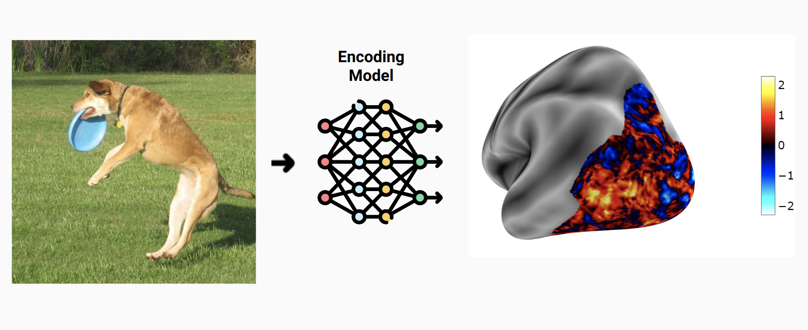

# Data
Data is originally split into 8 subjects, but due to time constraints we only use first subject.

* Input data: 9841 different images (in '.png' format). They come from the  [NSD  dataset](https://naturalscenesdataset.org/)

* Ouput data: fMRI visual responses (as '.npy' files) of both the left hemisphere ('lh_training_fmri.npy') and the right hemisphere ('rh_training_fmri.npy'). So it is divided into the left (LH) and right (RH) hemispheres, each having 19004 and 20544 vertices (so an output vector of 39548).  For more detailed explanation of data adquisition, see http://algonauts.csail.mit.edu/braindata.html 

Note: the fMRI data does not represent the whole brain, but rather only vertices (point on the surface of the brain) on the visual cortex, since it is knwon to be the region specifically dedicated to processing visual information.

# Methods

## Architectures
We tried three different approaches for this problem for the following reasons:
* Linearizing encoding model: because it is a common approach in the field
* Simple CNN (+/- PCA transform of target data): to test how some standard architecture could capture the complexity of the problem
* EfficientNet (+/- PCA transform of target data): because it is state-of-the-art in computer vision

## Training
Models were trained on IT University's HPC cluster.

## Code
All code used for creating the models, training and evaluating them can be found under src/. Log data from HPC runs can be found under hpc/.

# Evaluation metrics
With the aim of evaluating encoding accuracy of our model in computational neurosience, what is normally used is the Pearson's correlation between predicted and observed brain response. So we used two different metrics to evaluate:

* Pearson's correlation
* Mean Squared Error

In both cases it is computed across images, independently for each vertex.

# Experiments & results

## Linearizing Encoding model
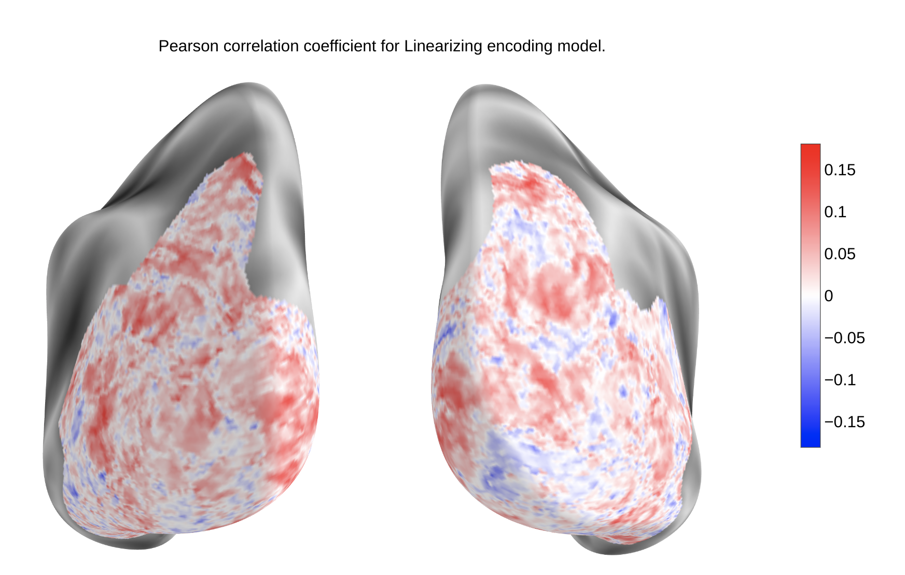

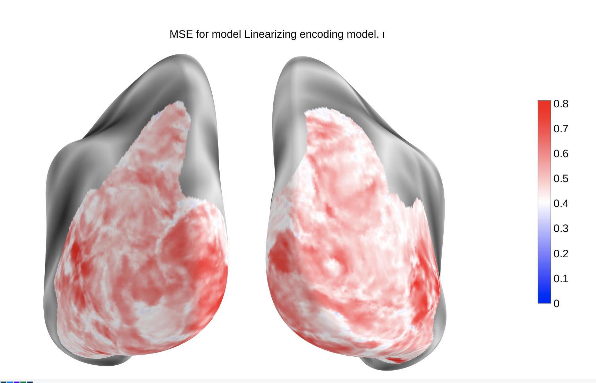

## Simple CNN
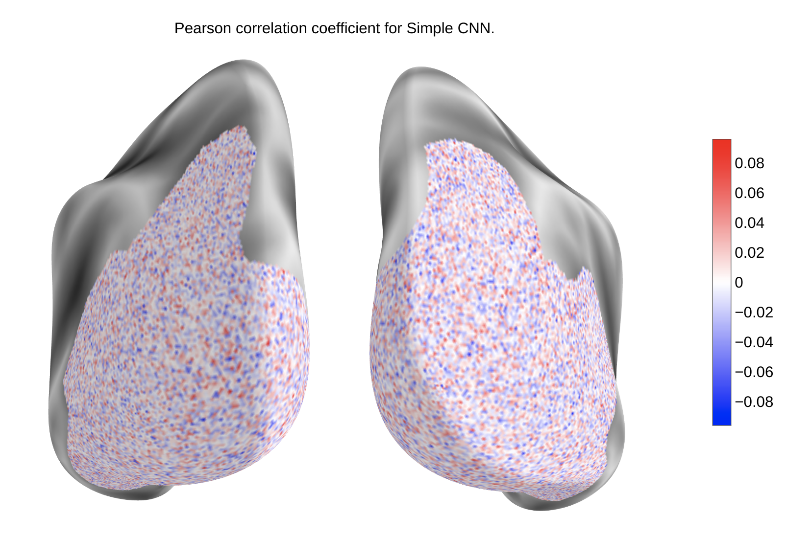

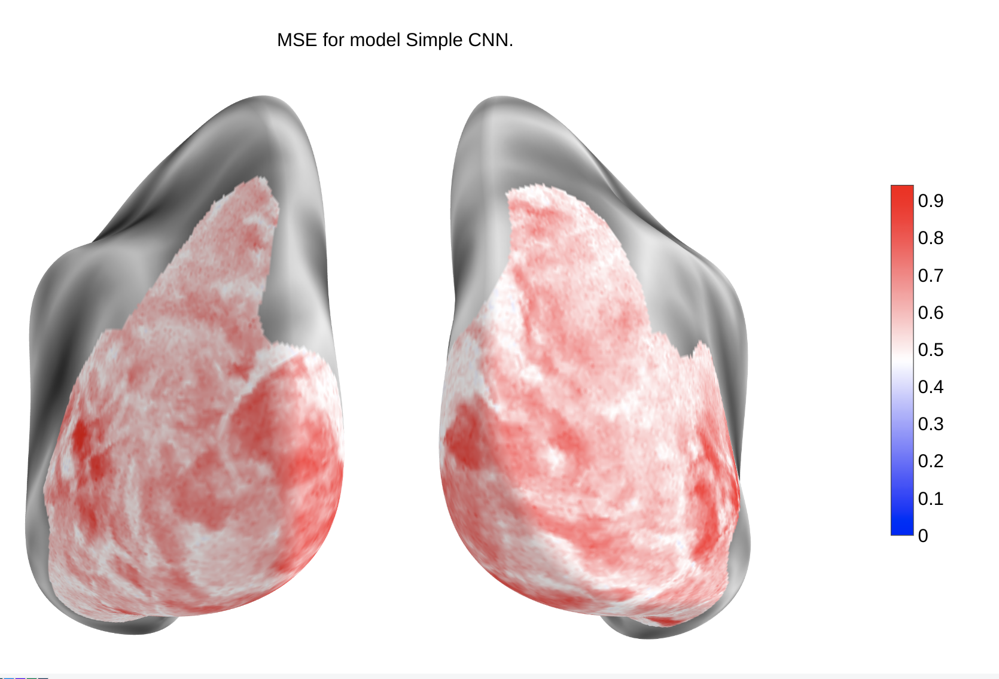

## Simple CNN + PCA transform
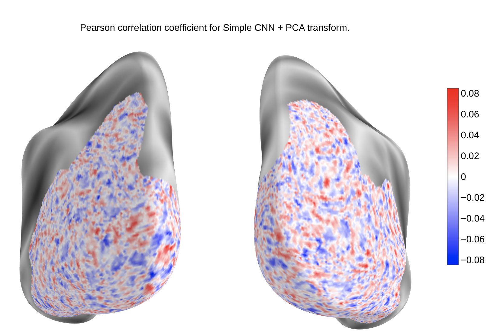

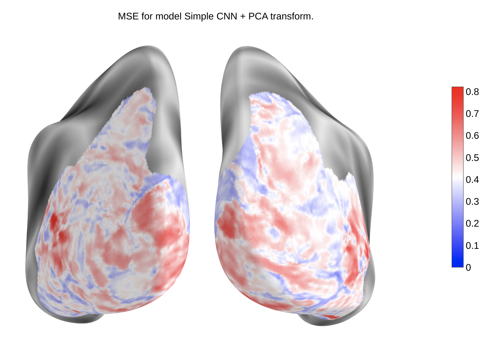

## Efficientnet
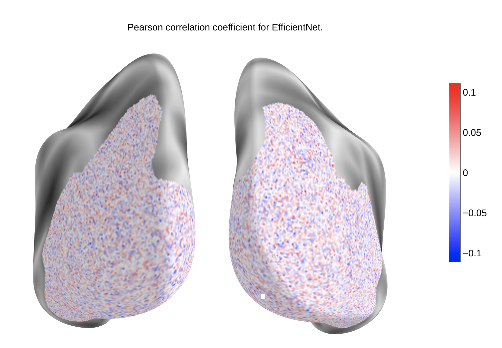

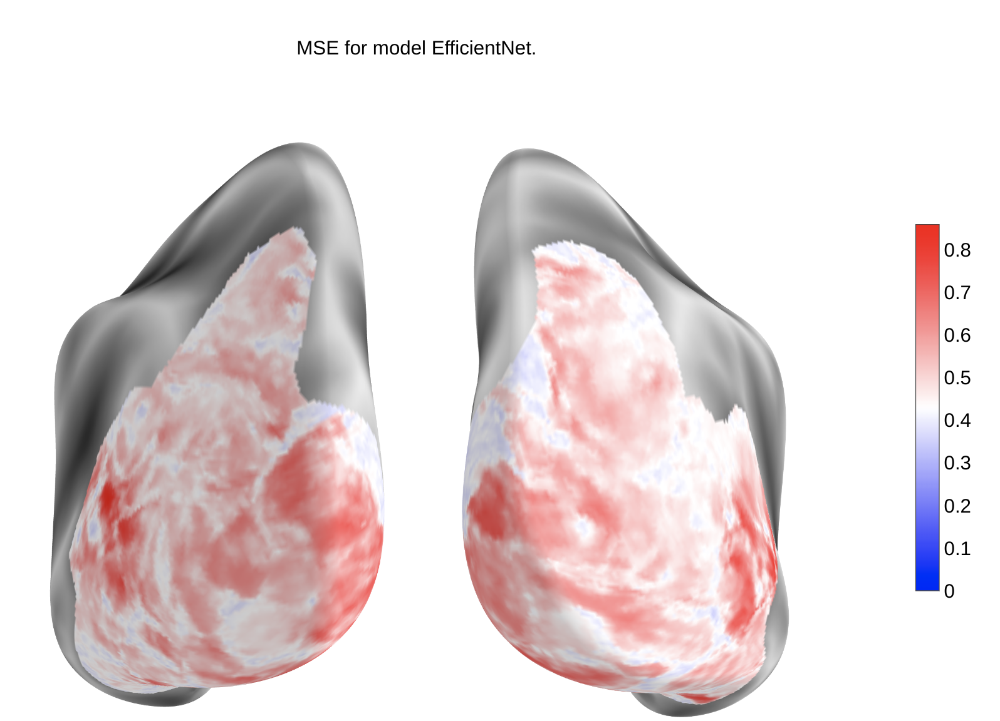

## Efficientnet + PCA transform
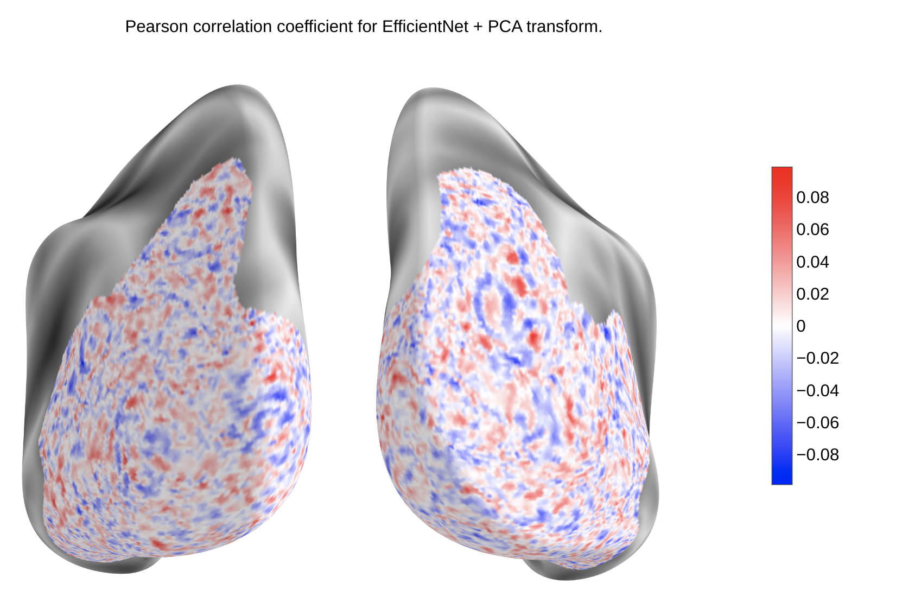

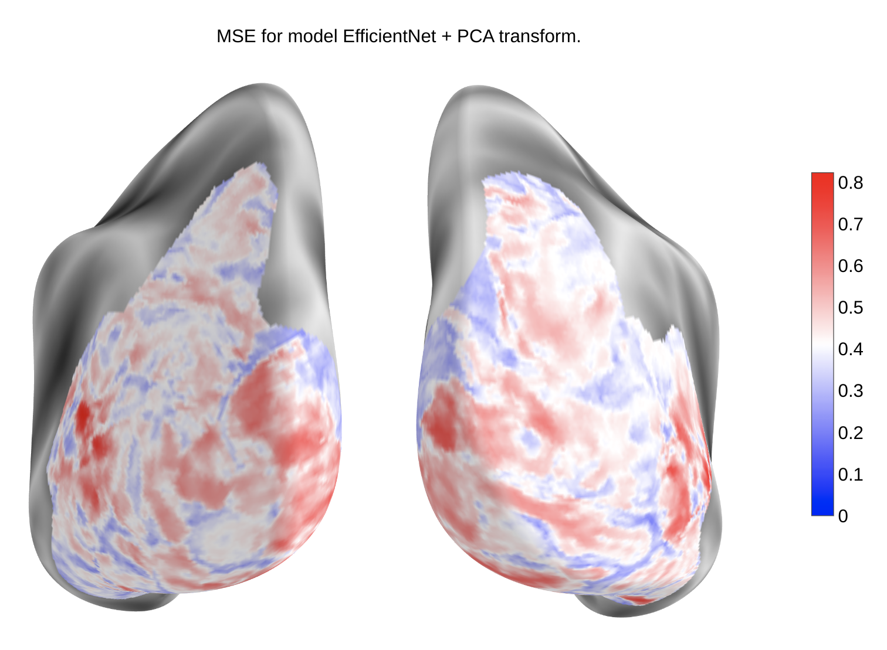

# Discussion
On the one hand, the linearizing encoding model did show some good results for the correlation metric, around 0.2. even if this does not look  very high, bear in mind that the correlaiton of the leaderboard for similar challenges from previous years were around 0.4.

On the other hand, our basic CNN apporach as well as our EfficientNet approach can be analyzed differently. When not using PCA transform on the output data, these architectures do not show neither correlation nor low MSE in the vertices. However, when applying PCA to the target data, we see that the CNNs that we have used point to the right direction, since there is an improvement of the MSE at some regions of the brain, at some areas even near 0. However, in terms of correlation per vertex, in any case they perform well

We indentify a misalignment between the metric we use during the training process of the CNNs (MSE) with what we also look for, which is correlation across images per vertex. We propose for future work to use a modified loss function that takes into account correlation.

Also we propose instead of using PCA as decoder from lower dimension to higher dimension, to use a more sophisticated decoder architecture that can also account for spacial information in the brain.